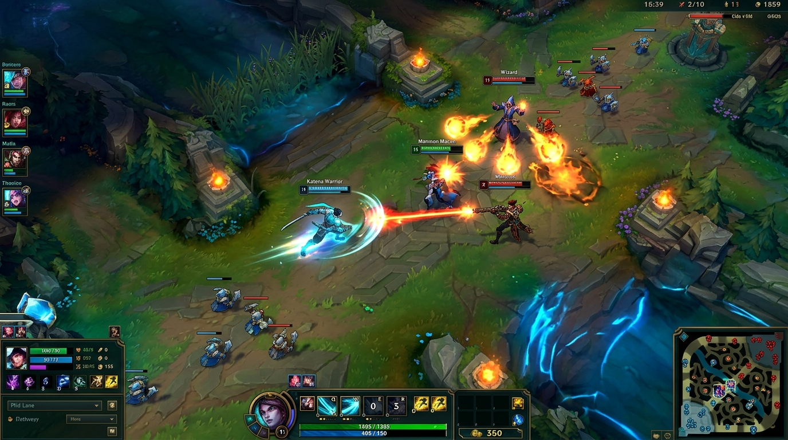
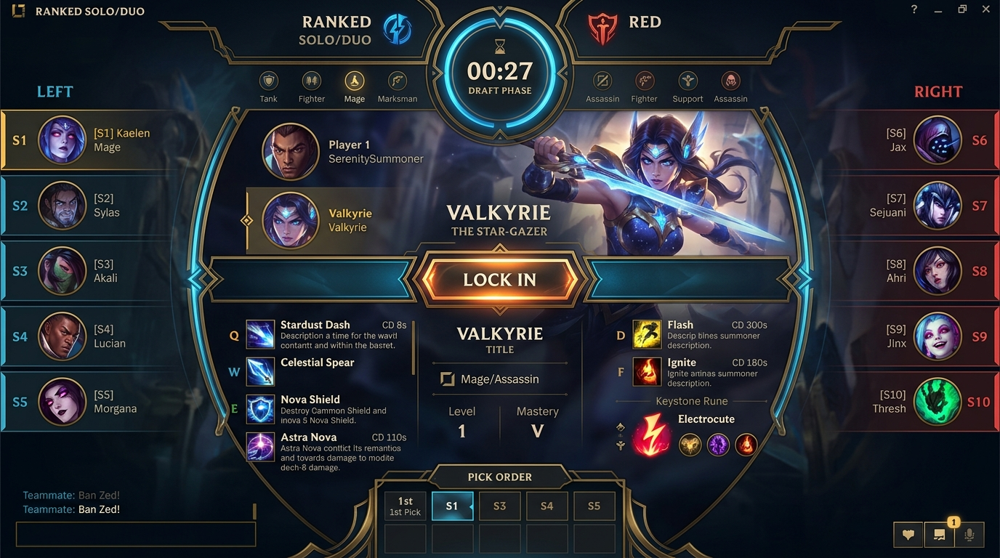

<div align="center">

# ⚔️ Web MOBA - 리그 오브 레전드 웹 아레나
**Zero-Install, Pure JavaScript Real-Time 60 FPS Multiplayer MOBA Game**

[](https://opensource.org/licenses/MIT)
[](https://nodejs.org/)
[](https://socket.io/)
[](https://developer.mozilla.org/en-US/docs/Web/API/WebGL_API)
[](#)
[](CONTRIBUTING.md)

웹 브라우저에서 설치 없이 즉시 실행되는 **실시간 60 FPS 쿼터뷰 MOBA(League of Legends 스타일) 대전 게임**입니다.  
사설망(프라이빗 LAN / 폐쇄망)에서도 인터넷 연결 없이 **100% 오프라인**으로 작동합니다.

[🎮 시작하기](#-빠른-시작-quick-start) • [🛡️ 챔피언 가이드](docs/CHAMPIONS.md) • [🏗️ 시스템 아키텍처](docs/ARCHITECTURE.md) • [🤝 오픈소스 기여 가이드](CONTRIBUTING.md)

---

### 📸 인게임 프리뷰 (Gameplay Preview)



### 🎯 드래프트 밴픽 화면 (Draft Pick Exclusivity)



</div>

---

## 🌟 핵심 특징 (Key Highlights)

* **🚫 무계정 즉시 접속**: 아이디/비밀번호 필요 없이 브라우저에서 닉네임만 입력하면 즉시 로비 입장
* **🌐 사설망(LAN) 자동 탐색**: 내부 IP 자동 감지 (`http://192.168.x.x:3000`), 같은 공유기 내 모든 기기(데스크톱, 노트북, 태블릿) 동시 대전
* **🔒 선착순 독점 밴픽 (Exclusive Draft Pick)**: 한 플레이어가 선택/확정한 챔피언은 다른 플레이어가 절대 중복 선택 불가 (단일 스레드 원자적 동시성 방어)
* **⚡ 60 FPS 서버 권한 루프 (Authoritative 60Hz Engine)**:
  * 서버 60 FPS 틱 루프 (`dt = ~0.0166s`) 기반 충돌/투사체/스킬/대미지 정밀 연산 (핵 방지 및 Desync 원천 차단)
  * 클라이언트 `requestAnimationFrame` 렌더 루프 및 위치 보간(Interpolation) 적용
* **🔊 100% 오프라인 절차적 오디오 (Procedural Web Audio Engine)**:
  * 외장 MP3/WAV 파일 의존 제로! Web Audio API 신디사이저로 칼 베는 소리, 총성, 화염구, 폭발음, 점멸 사운드, 킬 팡파레 실시간 합성
* **💥 고품질 시각 효과 (VFX & Polish)**:
  * 100-HP 분할 눈금 체력바 (리그 오브 레전드 정통 UI)
  * 투사체 파티클 꼬리, 착탄 충격파 링, 크리티컬 시 화면 흔들림(Screen Shake), 강물 흐름 애니메이션, 회전하는 넥서스 마법 수정

---

## 🕹️ 조작법 (Controls)

| 조작키 | 기능 | 설명 |
| :---: | :---: | :--- |
| **마우스 우클릭** | **이동 & 공격** | 커서 위치로 이동 (녹색 핑 링) 또는 적 타겟팅 공격 |
| **Q / W / E / R** | **챔피언 스킬** | 마우스 커서 방향으로 스마트키 즉시 시전 |
| **D** | **점멸 (Flash)** | 커서 방향으로 380 거리 즉시 순간이동 (쿨타임 45초) |
| **F** | **점화 / 회복** | 타깃 도트 피해(Ignite) 또는 즉시 체력 회복(Heal) |
| **SPACEBAR** | **화면 집중** | 카메라를 내 챔피언 위치로 즉시 센터링 |
| **🔊 / 🔇 버튼** | **사운드 토글** | 상단 스코어보드 우측에서 사운드 On/Off 토글 |

---

## ⚔️ 10인의 개성 넘치는 챔피언 (Champion Roster)

| 챔피언 | 역할군 | 패시브 (P) | 주요 스킬 (Q / W / E / R) |
| :---: | :---: | :--- | :--- |
| **⚔️ 검객 (Blademaster)** | 전사 / 암살자 | 3타 추가 고정 피해 & 이속 증가 | 직선 돌진 베기(Q) / 회전 베기(W) / 방패 쉴드(E) / **연속 난무 에어본(R)** |
| **🎯 저격수 (Sniper)** | 원거리 딜러 | 사거리 비례 치명타 | 고속 관통탄(Q) / 덫 속박(W) / 후방 텀블링(E) / **초장거리 저격탄(R)** |
| **🔥 화염술사 (Pyromancer)** | 광역 마법사 | 스킬 적중 시 연소 화상 도트 | 화염구 투사체(Q) / 화염 기둥 장판(W) / 폭발 밀치기(E) / **메테오 폭격(R)** |
| **🗡️ 암살자 (Shadow Assassin)** | 기동형 암살자 | 체력 35% 이하 추가 피해 | 수리검 3연발(Q) / 그림자 은신(W) / 배후 점멸(E) / **그림자 처형 난타(R)** |
| **🛡️ 수호자 (Guardian)** | 탱커 / 이니시에이터 | 체력 35% 이하 시 대형 쉴드 | 방패 돌진 스턴(Q) / 철벽 방어 피해감소(W) / 광역 도발(E) / **대지 분쇄 에어본(R)** |
| **❄️ 빙결술사 (Frost Mage)** | 메이지 / 서포터 | 3스택 오한 적중 시 빙결 기절 | 얼음 송곳(Q) / 빙판 둔화(W) / 서리 보호막(E) / **절대영도 광역 빙결(R)** |
| **🪓 광전사 (Berserker)** | 브루저 / 파이터 | 잃은 체력 비례 공격속도/공격력 | 쌍도끼 투척(Q) / 광포화 공속 버프(W) / 피의 갈망 흡혈(E) / **불사의 분노 무적(R)** |
| **🏹 그림자 사냥꾼 (Shadow Hunter)**| 기동형 원딜 | 적 추격 시 이속 대폭 증가 | 구르기 강화탄(Q) / 은화살 3타 고정 피해(W) / 밀쳐내기 스턴(E) / **결전의 시간 버프(R)** |
| **🥊 격투가 (Brawler)** | 콤보 브루저 | 스킬 사용 후 다음 평타 강화 | 정권 찌르기(Q) / 반격 가드(W) / 무릎 돌진(E) / **승룡권 제압(R)** |
| **💣 폭탄광 (Demolitionist)** | 포킹 딜러 | 사망 시 거대 자폭탄 투하 | 통통 바운스 폭탄(Q) / 점착 넉백 폭약(W) / 지뢰밭(E) / **거대 지옥불 핵폭탄(R)** |

> 자세한 계수, 사거리, 쿨타임 정보는 [docs/CHAMPIONS.md](docs/CHAMPIONS.md)를 참고하세요.

---

## 🚀 빠른 시작 (Quick Start)

### 1. 사전 요구사항
* [Node.js](https://nodejs.org/) v18.0.0 이상

### 2. 설치 및 실행
```bash
# 1. 저장소 클론
git clone https://github.com/iamywl/Web_game.git
cd Web_game

# 2. 의존성 패키지 설치
npm install

# 3. 게임 서버 실행 (60 FPS 권위 서버)
npm start
```

### 3. 브라우저 접속
* **로컬 접속**: 브라우저 주소창에 `http://localhost:3000` 입력
* **LAN 사설망 접속**: 콘솔 터미널에 출력된 `http://<내부IP>:3000` 주소로 접속

---

## 🧪 자동화 QA 테스트 실행 (Automated QA Suite)

프로젝트에 탑재된 무인 헤드리스 가상 봇 클라이언트를 구동하여 19개 핵심 기능(동시 픽 경쟁, 스킬 물리, 대미지 감쇄, 접속 끊김 내결함성)을 전수 검증할 수 있습니다:

```bash
# 전체 통합 QA 테스트 실행
npm test
# 또는
node test/qa_suite.js
```

---

## 📁 프로젝트 구조 (Project Structure)

```
Web_game/
├── public/                       # 프론트엔드 정적 에셋 (100% 로컬 동작)
│   ├── css/
│   │   └── style.css            # 롤 헥스테크 다크 테마 UI 스타일시트
│   ├── js/
│   │   ├── audio.js             # Web Audio API 절차적 사운드 신디사이저
│   │   ├── renderer.js          # 협곡 맵, 챔피언 모델, 파티클 VFX 렌더러
│   │   └── client.js            # 소켓 클라이언트, 인풋 컨트롤러, 60 FPS 루프
│   ├── lib/
│   │   └── pixi.min.js          # 로컬 번들 Pixi.js (오프라인 지원)
│   └── index.html               # SPA 메인 뷰 (로그인, 로비, 밴픽, 인게임)
├── server/
│   ├── game/
│   │   ├── ChampionData.js      # 10종 챔피언 스탯, QWER 스킬, D/F 주문
│   │   ├── GameEngine.js        # 60 FPS 서버 권한 루프, 물리, 충돌, 스킬 연산
│   │   ├── Room.js              # 방 상태 머신 & 챔피언 선착순 독점 락인
│   │   └── RoomManager.js       # LAN 유저 세션 및 방 매칭 라우팅
│   └── server.js                # Express + Socket.IO 메인 서버
├── test/
│   └── qa_suite.js              # 4인 동시성 및 전투 시뮬레이션 QA 테스트
├── docs/                        # 상세 기술 문서 및 가이드
│   ├── images/                  # 게임 캡처 스크린샷
│   ├── ARCHITECTURE.md          # 60 FPS 네트워크 & 물리 아키텍처 문서
│   └── CHAMPIONS.md             # 10종 챔피언 상세 스펙 문서
├── CONTRIBUTING.md              # 오픈소스 기여 가이드
├── package.json
└── README.md
```

---

## 🤝 오픈소스 기여하기 (Contributing)

누구나 새로운 챔피언, 스킬 메커니즘, 맵 지형, 사운드 이펙트를 추가할 수 있습니다!  
자세한 기여 방법과 새 챔피언 추가 가이드는 [CONTRIBUTING.md](CONTRIBUTING.md) 문서를 확인해 주세요.

1. 이 저장소를 Fork 합니다.
2. 새 기능 브랜치를 생성합니다 (`git checkout -b feat/new-champion`).
3. 변경 사항을 커밋합니다 (`git commit -m "feat: Add new Assassin champion"`).
4. 브랜치에 푸시합니다 (`git push origin feat/new-champion`).
5. Pull Request를 생성합니다.

---

## 📄 라이선스 (License)

이 프로젝트는 [MIT License](LICENSE)에 따라 오픈소스로 배포됩니다.
