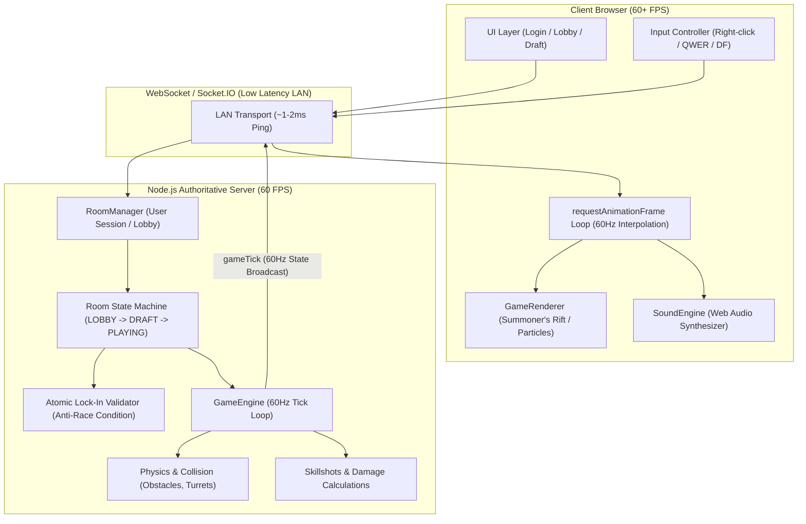
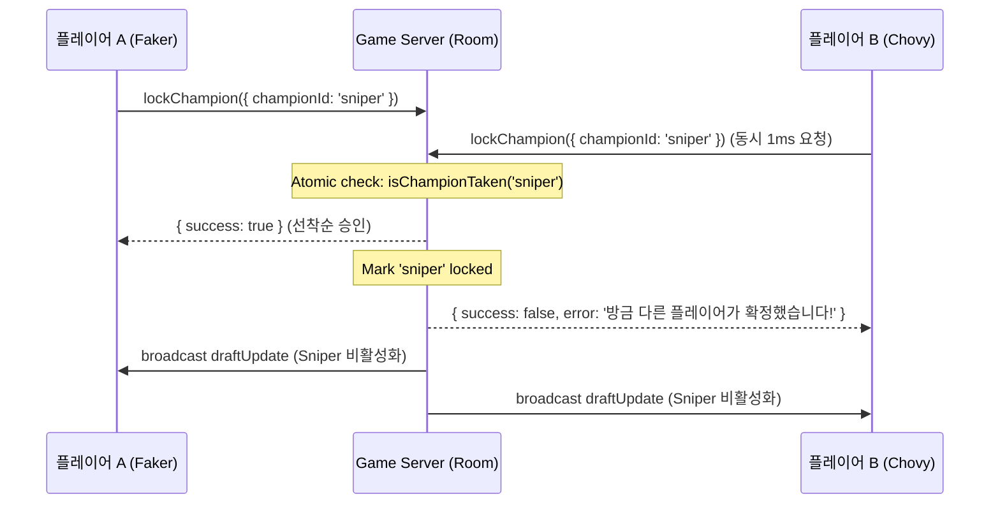

# 🏗️ Web MOBA 시스템 아키텍처 (System Architecture)

이 문서는 `Web MOBA`의 60 FPS 권위 서버 모델, 네트워크 프로토콜 수명 주기, 물리 및 충돌 처리 엔진의 설계 구조를 설명합니다.

---

## 1. 전체 아키텍처 다이어그램 (Overall Architecture)

---

## 2. 권위 서버 모델 (Authoritative Server Model)

클라이언트는 권한이 없으며 오직 사용자의 입력 의도(키 입력, 마우스 좌표)만을 서버로 전송합니다:
* **클라이언트의 역할**:
  * 마우스 우클릭 좌표 ➔ `socket.emit('playerMove', { x, y })`
  * 스킬 키 및 커서 방향 ➔ `socket.emit('castSkill', { key, targetX, targetY })`
  * 서버에서 수신한 `gameTick` 상태를 화면에 보간(Interpolation) 렌더링
* **서버의 역할**:
  * 1초에 60회 (`TICK_RATE = 60`, `dt = ~0.0166s`) 고정 틱 루프 구동
  * 투사체 이동, 히트박스 충돌 판정, 방어력/쉴드 대미지 감쇄, 사망 및 리스폰
  * 단일 진실의 근원(Single Source of Truth)으로서 클라이언트에 브로드캐스트

---

## 3. 선착순 챔피언 독점 락인 (Draft Pick Exclusivity)

Node.js의 단일 스레드 이벤트 루프 특성을 활용하여 동시 픽 경합(Race Condition)을 원자적으로 방어합니다:

---

## 4. 충돌 및 물리 판정 (Physics & Hitbox Detection)

1. **원형 투사체 vs 챔피언 충돌**:
   $$\text{dist} = \sqrt{(x_1 - x_2)^2 + (y_1 - y_2)^2} \le r_{\text{proj}} + r_{\text{victim}}$$
2. **0거리 나눗셈 보호 (Zero-distance Guard)**:
   플레이어 위치와 대상 좌표가 일치할 때 `dx / dist = 0 / 0 = NaN`이 발생하여 플레이어 좌표가 `null`로 손상되는 현상을 방지하기 위해 `safeDist = dist > 0.001 ? dist : 1` 안전 분모 처리를 적용했습니다.
3. **지형 충돌 (Obstacles & Turrets Pushback)**:
   벽이나 포탑 반지름 안으로 플레이어가 침범할 경우, 중심 벡터 방향으로 반지름 차이만큼 바깥쪽으로 즉시 보정(Pushback)합니다.
